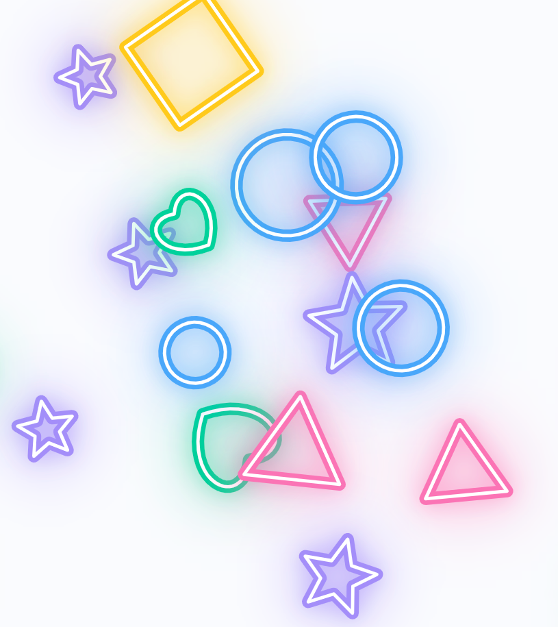

# Baby Theremin Shapes — README (v1.7.8)

ブラウザで遊べるキッズ向けビジュアル・テルミンです。  
短いタップで図形がはじけ、長押しでテルミン音を持続させながら高さ（ピッチ）をコントロールできます。  
**PWA 対応**（ホーム画面に追加可）、**オフライン動作**（Service Worker）に対応しています。

---


---

## スクリーンショット



## 収録ファイル
```
index.html
manifest.json
sw.js
icon-192.png
icon-512.png
Chime.mp3
```

---

## 特長
- 指一本の**短タップ**：効果音 + 図形バースト
- **長押し + 指移動**：テルミン（指を離すと停止）
- **2本指長押し（約 1.1 秒）**：操作パネルの表示/非表示（**三連タップ**でも可）
- **3 つのプリセット曲**（最小限の音質調整）
- きらびやかな**グロー線**によるアニメーション
- PWA/オフライン対応（`sw.js`）

---

## 使い方
1. `index.html` をブラウザで開く（初回は**一度タップ**して音声を有効化してください）。
2. 画面を**短くタップ**：図形がはじけ、効果音が鳴ります。
3. 画面を**長押ししながら上下にドラッグ**：テルミンの音程が変わります。**指を離すと停止**します。
4. **2 本指で長押し**（約 1.1 秒）または**三連タップ**：操作パネルの表示/非表示を切替。

### 操作パネル
- **🎵 音楽をえらぶ**：BGM を読み込みます  
  - PC/Android：**フォルダ選択**（`webkitdirectory`）に対応  
  - iOS/iPadOS（Safari）：**複数ファイル選択**に自動切替（フォルダ選択は OS 仕様上不可）
- **🎶 プリセット**：3 曲から選択（BGM 再生と排他）
- **BGM 音量 / テルミン音量**：最小限の音質調整
- **かず**：画面内の図形の数
- **せんの太さ / ひかり / ビート反応**：見た目の微調整

---

## よくある質問（FAQ）
**Q. 音が鳴らない**  
A. 初回はユーザー操作（タップ等）が必要です。ページをタップしてからお試しください。

**Q. ボタンが反応しない/画面が真っ暗**  
A. 一度ハードリロードしてください。PWA とキャッシュの影響の可能性があります。

**Q. 操作パネルが出ない**  
A. 画面上で**2 本指長押し（約 1.1 秒）**、または**三連タップ**をお試しください。

**Q. iPhone でフォルダが選べない**  
A. iOS 仕様のため**複数ファイル選択**をご利用ください。

---
